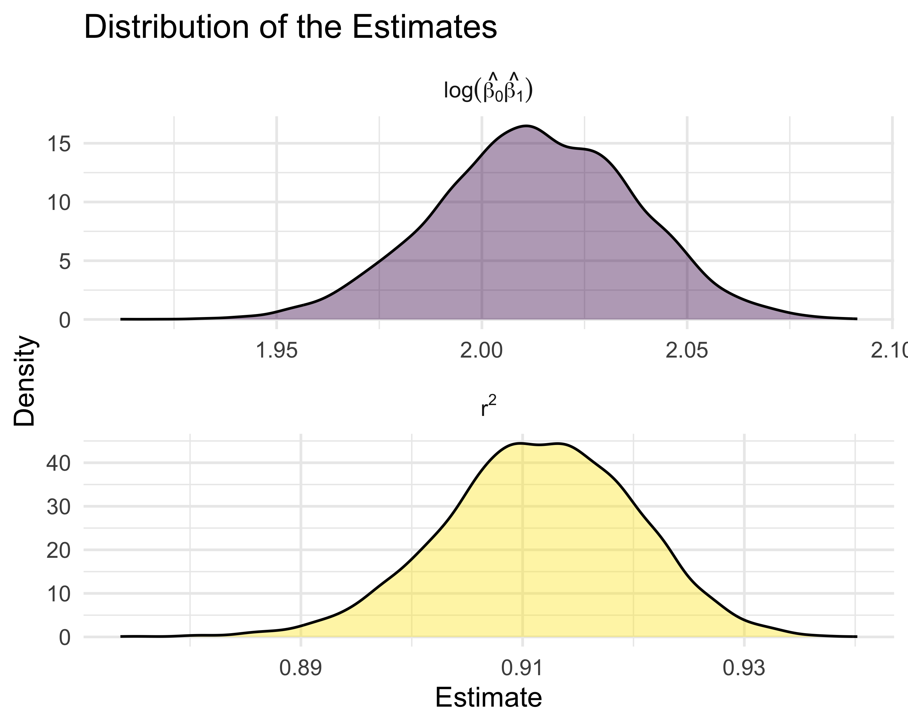

Linear Models
================
Chhiring Lama
2024-11-27

## Problem 1

``` r
weather_df <-  
  rnoaa::meteo_pull_monitors(
    c("USW00094728"),
    var = c("PRCP", "TMIN", "TMAX"), 
    date_min = "2017-01-01",
    date_max = "2017-12-31") %>%
  mutate(
    name = recode(id, USW00094728 = "CentralPark_NY"),
    tmin = tmin / 10,
    tmax = tmax / 10) %>%
  select(name, id, everything())
```

Running simple linear regression with `tmax` as the response and `tmin`
as the predictor in 5000 bootstrap samples:

``` r
bootstraps <- weather_df |> 
  modelr::bootstrap(5000) |> 
  mutate(strap = map(strap, as_tibble), 
         linear_model = map(strap, \(df) lm(tmax ~ tmin, data = df)), 
    results = map(linear_model, broom::tidy), 
    summary = map(linear_model, broom::glance))

bootstrap_r_squared <- bootstraps |> 
  unnest(summary) |> 
  select(.id, `r.squared`) 

bootstrap_log_estimate <- bootstraps |> 
  unnest(results) |> 
  select(.id, estimate) |> 
  group_by(`.id`) |> 
  summarize(log_estimate = prod(estimate) |> log()) 

merged_results <- bootstrap_r_squared |> 
  inner_join(bootstrap_log_estimate, by = ".id")
```

Plot the distribution of the $r^2$ and
$log(\hat{\beta_0} *\hat{\beta_1})$ estimates.

``` r
merged_results |> 
  pivot_longer(
    cols = 2:3, 
    names_to = "type",
    values_to = "estimate"
  ) |> 
  mutate(
    labels = case_when(type == "log_estimate" ~ "log(hat(beta[0])*hat(beta[1]))", 
                      type == "r.squared" ~ "r^2")) |> 
  ggplot(aes(x = estimate, fill = type)) +
  geom_density(alpha = 0.4) +
  facet_wrap(~labels, scales = "free", 
             ncol = 1, labeller = label_parsed) +
  theme(legend.position = "none") +
  labs(x = "Estimate", 
       y = "Density", title = "Distribution of the Estimates")
```



The estimates of $r^2$ and $log(\hat{\beta_0}*\hat{\beta_1})$ (as shown
above) are normally distributed.

``` r
r_squared_ci <- bootstrap_r_squared |> 
  summarise(boot_ci_ll = quantile(`r.squared`, 0.025) |> round(digits = 3), 
            boot_ci_ul = quantile(`r.squared`, 0.975) |> round(digits = 3))

log_estimate_ci <- bootstrap_log_estimate |> 
  summarise(boot_ci_ll = quantile(log_estimate, 0.025) |> round(digits = 3), 
            boot_ci_ul = quantile(log_estimate, 0.975) |> round(digits = 3))
```

95% confidence interval for $r^2$ and $log(\hat{\beta_0}*\hat{\beta_1})$
are (0.894, 0.927) and (1.965, 2.059) respectively. We are 95% sure that
the simple linear model explains between 0.894 and 0.927 of variance in
the maximum temperature.
