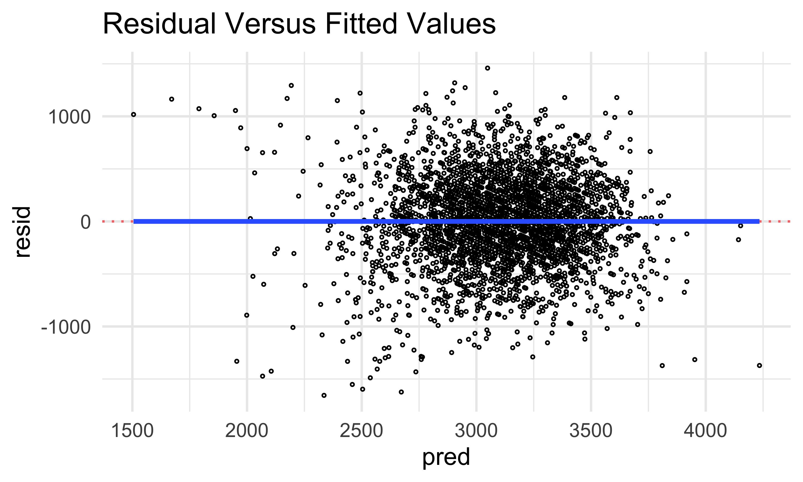

Linear Models
================
Chhiring Lama
2024-11-27

## Problem 1

``` r
weather_df <-  
  rnoaa::meteo_pull_monitors(
    c("USW00094728"),
    var = c("PRCP", "TMIN", "TMAX"), 
    date_min = "2017-01-01",
    date_max = "2017-12-31") %>%
  mutate(
    name = recode(id, USW00094728 = "CentralPark_NY"),
    tmin = tmin / 10,
    tmax = tmax / 10) %>%
  select(name, id, everything())
```

Running simple linear regression with `tmax` as the response and `tmin`
as the predictor in 5000 bootstrap samples:

``` r
bootstraps <- weather_df |> 
  modelr::bootstrap(5000) |> 
  mutate(strap = map(strap, as_tibble), 
         linear_model = map(strap, \(df) lm(tmax ~ tmin, data = df)), 
    results = map(linear_model, broom::tidy), 
    summary = map(linear_model, broom::glance))

bootstrap_r_squared <- bootstraps |> 
  unnest(summary) |> 
  select(.id, `r.squared`) 

bootstrap_log_estimate <- bootstraps |> 
  unnest(results) |> 
  select(.id, estimate) |> 
  group_by(`.id`) |> 
  summarize(log_estimate = prod(estimate) |> log()) 

merged_results <- bootstrap_r_squared |> 
  inner_join(bootstrap_log_estimate, by = ".id")
```

Plot the distribution of the $r^2$ and
$log(\hat{\beta_0} *\hat{\beta_1})$ estimates.

``` r
merged_results |> 
  pivot_longer(
    cols = 2:3, 
    names_to = "type",
    values_to = "estimate"
  ) |> 
  mutate(
    labels = case_when(type == "log_estimate" ~ "log(hat(beta[0])*hat(beta[1]))", 
                      type == "r.squared" ~ "r^2")) |> 
  ggplot(aes(x = estimate, fill = type)) +
  geom_density(alpha = 0.4) +
  facet_wrap(~labels, scales = "free", 
             ncol = 1, labeller = label_parsed) +
  theme(legend.position = "none") +
  labs(x = "Estimate", 
       y = "Density", title = "Distribution of the Estimates")
```


The estimates of $r^2$ and $log(\hat{\beta_0}*\hat{\beta_1})$ (as shown
above) are normally distributed.

``` r
r_squared_ci <- bootstrap_r_squared |> 
  summarise(boot_ci_ll = quantile(`r.squared`, 0.025) |> round(digits = 3), 
            boot_ci_ul = quantile(`r.squared`, 0.975) |> round(digits = 3))

log_estimate_ci <- bootstrap_log_estimate |> 
  summarise(boot_ci_ll = quantile(log_estimate, 0.025) |> round(digits = 3), 
            boot_ci_ul = quantile(log_estimate, 0.975) |> round(digits = 3))
```

95% confidence interval for $r^2$ and $log(\hat{\beta_0}*\hat{\beta_1})$
are (0.894, 0.927) and (1.965, 2.059) respectively. We are 95% sure that
the model explains between 0.894 and 0.927 of variance in the maximum
temperature.

## Problem 2

Import and clean homicide data from the Washington Post:

``` r
homicide_data <- read_csv("data/homicide-data.csv") |> 
  mutate(state = toupper(state), 
         city_state = str_c(city, state, sep = ", "), 
         result = case_when(disposition %in% c("Closed without arrest", 
                                                "Open/No arrest") ~ "unresolved", 
                            disposition == "Closed by arrest" ~ "resolved"), 
         result = as_factor(result), 
         victim_age = as.numeric(victim_age), 
         result = as.numeric(result == "resolved"),
    victim_race = fct_relevel(victim_race, "White")) |> 
  filter(!city_state %in% c("Dallas, TX", "Phoenix, AZ", 
                            "Kansas City, MO","Tulsa, AL"), 
         victim_race %in% c("White", "Black"))
```

Run logistic Regression with `result` (resolved versus unresolved) as
the outcome and victim age, sex and race as predictors for Baltimore,
MD.

``` r
baltimore_df <- homicide_data |> 
  filter(city_state == "Baltimore, MD") |> 
  select(result, victim_age, victim_race, victim_sex)

logistic_mod <- glm(result ~ victim_age + victim_sex + victim_race, 
                    data = baltimore_df, family = binomial())
saveRDS(logistic_mod, "logistic_mod_baltimore_result.rds")

logistic_mod <- logistic_mod |> 
  broom::tidy() |> 
  mutate(adj_OR = exp(estimate), 
         ci_ll = round(exp(estimate - 1.96 * std.error), 3), 
         ci_ul = round(exp(estimate + 1.96 * std.error), 3)) |>
  select(term, adj_OR, ci_ll, ci_ul, p.value) 

res_male <- logistic_mod |> 
  filter(term == "victim_sexMale") 

or_male <- pull(res_male, `adj_OR`) |> 
  round(digits = 3)

logistic_mod |> 
  knitr::kable(digits = 3) 
```

| term             | adj_OR | ci_ll | ci_ul | p.value |
|:-----------------|-------:|------:|------:|--------:|
| (Intercept)      |  3.164 | 1.989 | 5.031 |   0.000 |
| victim_age       |  0.993 | 0.987 | 1.000 |   0.043 |
| victim_sexMale   |  0.426 | 0.325 | 0.558 |   0.000 |
| victim_raceBlack |  0.431 | 0.306 | 0.607 |   0.000 |

Upon running the logistic regression, at 5% significance level and after
keeping all other variables fixed, we have significant evidence that
male victims have lower probability (0.574 less likely) of having
homicides solved compared to female victims. We are 95% confident that
the true adjusted odds ratio is between 0.325 and 0.558.

Run the model for each city in the dataset

``` r
logistic_allcities_df <- homicide_data |> 
  filter(victim_sex %in% c("Female", "Male")) |> 
  nest(data = -city_state) |> 
  mutate(
    model = map(data, \(x) glm(result ~ victim_age + victim_sex + victim_race, 
                    data = x, family = binomial())), 
    results = map(model, broom::tidy)
  ) |> 
  select(city_state, results) |> 
  unnest(results) |> 
  filter(term == "victim_sexMale") |> 
  mutate(adj_OR = exp(estimate), 
         ci_ll = round(exp(estimate - 1.96 * std.error), 3), 
         ci_ul = round(exp(estimate + 1.96 * std.error), 3)) |>
  select(city_state, term, adj_OR, ci_ll, ci_ul, p.value) 
```

Plot ORs and CIs for each city

``` r
logistic_allcities_df |> 
  mutate(city_state = fct_reorder(city_state, adj_OR)) |>
  ggplot(aes(x = city_state, y = adj_OR)) +
  geom_hline(yintercept = 1, linetype = "dashed", color = "grey") +
  geom_errorbar(aes(ymin = ci_ll, ymax = ci_ul),color = "darkred", width = 0.5)+
  geom_point(size = 2, shape = 21, fill = "white") +
  theme(plot.title = element_text(size = 10, face = "bold"), 
        axis.title = element_text(size = 9, face = "bold")) +
  labs(y = "Adjusted Odds Ratio", x = "City",
       title = "Adj. OR (w/ 95% CI) for Solved Cases in Male v/s Female", color = "") +
  coord_flip()
```


There are four cities where estimated adjusted odds ratio is greater
than one (Albuquerque, Stockton, Fresno and Nashville) which means that
male victims in these cities are more likely to have their case resolved
compared to female victims. In all the other 43 cities, male victims
have less odds of a resolved homicide case than female victims. In
Richmond and Atlanta, male and females have almost equal chance of
solved case.

## Problem 3

Load and clean the child birthweight dataset.

``` r
child_df <- read_csv("data/birthweight.csv") |> 
  mutate(
    babysex = case_when(babysex == 1 ~ "Male", 
                        babysex == 2 ~ "Female"), 
    babysex = fct_relevel(babysex, "Male"), 
    frace = case_when(frace == 1 ~ "White", 
                      frace == 2 ~ "Black", 
                      frace == 3 ~ "Asian", 
                      frace == 4 ~ "Puerto Rican", 
                      frace == 8 ~ "Other", 
                      frace == 9 ~ "Unknown"),
    frace = fct_relevel(frace, "White"), 
    malform = case_when(malform == 0 ~ "absent", 
                        malform == 1 ~ "present"), 
    malform = fct_relevel(malform, "absent"), 
    mrace = case_when(mrace == 1 ~ "White", 
                      mrace == 2 ~ "Black", 
                      mrace == 3 ~ "Asian", 
                      mrace == 4 ~ "Puerto Rican", 
                      mrace == 8 ~ "Other"),
    mrace = fct_relevel(mrace, "White")
    )

missing_value_check <- unique(is.na(child_df))
```

The child birthweight dataset consists of 4 categorical variables
(`babysex`, `frace`, `malform` and `mrace`) representing sec of the
baby, father’s race, presence of any malformation that could affect
baby’s weight and mother’s race. There are 16 numerical variables.

I am interested to check if birthweight can be predicted using mother’s
delivery weight after accounting for all other observations related to
her. So, first I checked the correlation between related continuous
variables.

``` r
my_data <- child_df[, c("delwt","menarche", "ppbmi", "wtgain", "mheight", "ppwt", 
                        "momage", "gaweeks", "pnumsga", "parity", "smoken")]
chart.Correlation(my_data, histogram=TRUE, pch=19)
```


Mother’s pre-pregancy BMI - which is based on their height/weight at
that point - correlates with weight at delivery too, so I used `delwt`
along with `ppbmi` along with interaction terms to test their combined
effects. The value for `ppbmi` is derived from `mheight` and `ppwt`, so
using these variable will be redundant. Number of prior small for
gestational age babies all have value of 0 and number of live births
prior to this pregnancy are mostly 0, so they are not an informative
variable. Therefore, I first start by proposing a multiple linear
regression for birthweight as `delwt`, `menarche`, `wtgain`, `ppbmi`,
`momage`, `gaweeks`, `smoken` and additional categorical variable:
mother’s race.

``` r
child_df <- child_df |> 
  mutate(id = row_number())

train_df <- sample_frac(
  child_df, 
  size = .8
)

test_df <- anti_join(child_df, train_df, by = "id")
```

Visualize the relation between birthweight and mother’s weight during
delivery

``` r
train_df |> 
  ggplot(aes(x = delwt, y = bwt), size = 0.2) + 
  geom_point()+
  geom_point(data = test_df, color = "skyblue")
```


Fit the linear multiple regression model with the above mentioned
predictors

``` r
linear_mod = lm(bwt ~ delwt*ppbmi + menarche + momage*gaweeks +smoken +mrace, data = train_df)
linear_mod |> 
  broom::tidy() 
```

    ## # A tibble: 12 × 5
    ##    term              estimate std.error statistic  p.value
    ##    <chr>                <dbl>     <dbl>     <dbl>    <dbl>
    ##  1 (Intercept)        841.     508.         1.65  9.80e- 2
    ##  2 delwt               17.7      1.51      11.7   3.17e-31
    ##  3 ppbmi               39.9     10.6        3.76  1.72e- 4
    ##  4 menarche            -5.70     5.02      -1.14  2.56e- 1
    ##  5 momage             -85.7     22.8       -3.75  1.79e- 4
    ##  6 gaweeks              8.55    11.3        0.754 4.51e- 1
    ##  7 smoken             -11.0      0.980    -11.2   1.42e-28
    ##  8 mraceAsian         -21.1     76.4       -0.277 7.82e- 1
    ##  9 mraceBlack        -272.      16.6      -16.4   2.38e-58
    ## 10 mracePuerto Rican -105.      32.7       -3.20  1.38e- 3
    ## 11 delwt:ppbmi         -0.405    0.0624    -6.49  9.51e-11
    ## 12 momage:gaweeks       2.20     0.578      3.81  1.44e- 4

``` r
linear_mod |> 
  broom::glance() 
```

    ## # A tibble: 1 × 12
    ##   r.squared adj.r.squared sigma statistic   p.value    df  logLik    AIC    BIC
    ##       <dbl>         <dbl> <dbl>     <dbl>     <dbl> <dbl>   <dbl>  <dbl>  <dbl>
    ## 1     0.322         0.320  420.      149. 4.37e-282    11 -25908. 51842. 51922.
    ## # ℹ 3 more variables: deviance <dbl>, df.residual <int>, nobs <int>

As we can see above, at 5% significance level, mother’s menarche. So, I
removed the predictor from the model

``` r
linear_modv2 = lm(bwt ~ delwt*ppbmi + momage*gaweeks +smoken +mrace, data = train_df)
linear_modv2 |> 
  broom::tidy()
```

    ## # A tibble: 11 × 5
    ##    term              estimate std.error statistic  p.value
    ##    <chr>                <dbl>     <dbl>     <dbl>    <dbl>
    ##  1 (Intercept)        760.     503.         1.51  1.31e- 1
    ##  2 delwt               17.7      1.51      11.8   2.62e-31
    ##  3 ppbmi               40.5     10.6        3.82  1.37e- 4
    ##  4 momage             -85.8     22.8       -3.76  1.76e- 4
    ##  5 gaweeks              8.75    11.3        0.772 4.40e- 1
    ##  6 smoken             -11.0      0.980    -11.2   1.15e-28
    ##  7 mraceAsian         -24.9     76.3       -0.327 7.44e- 1
    ##  8 mraceBlack        -273.      16.5      -16.5   4.14e-59
    ##  9 mracePuerto Rican -106.      32.7       -3.24  1.21e- 3
    ## 10 delwt:ppbmi         -0.406    0.0624    -6.51  8.33e-11
    ## 11 momage:gaweeks       2.19     0.578      3.79  1.53e- 4

``` r
linear_modv2 |> 
  broom::glance() 
```

    ## # A tibble: 1 × 12
    ##   r.squared adj.r.squared sigma statistic   p.value    df  logLik    AIC    BIC
    ##       <dbl>         <dbl> <dbl>     <dbl>     <dbl> <dbl>   <dbl>  <dbl>  <dbl>
    ## 1     0.322         0.320  420.      164. 6.31e-283    10 -25908. 51841. 51915.
    ## # ℹ 3 more variables: deviance <dbl>, df.residual <int>, nobs <int>

Look at the fits in the training data:

``` r
train_df |> 
  add_predictions(linear_modv2) |> 
  add_residuals(linear_modv2) |> 
  ggplot(aes(x = pred, y = resid)) + 
  geom_hline(yintercept = 0, color = "red", alpha = 0.6, linetype = "dotted") +
  geom_point(size = 0.4, color = "black", shape = 21)+
  labs(title = "Residual Versus Fitted Values")
```


The “spread” of the points in the plot are remain similar across
different predicted values, and their residuals do not follow a specific
“trend”. So, we can assume linearity and homoscedasticity in the model
above.

Adding the two other models and cross-validation of all three models: \*
Model1: Linear model above with mothers’ delivery weight, age, race,
gestational period and number of cigarrettes smokes during pregnancy. \*
Model2: One using length at birth and gestational age as predictors
(main effects only) \* Model3: One using head circumference, length,
sex, and all interactions (including the three-way interaction) between
these.

``` r
cv_df <- crossv_mc(child_df, 100) |> 
  mutate(
    train = map(train, as_tibble),
    test = map(test, as_tibble))
  

cv_res_df <- cv_df |> 
  mutate(
    mod_w_mom = map(train, \(x) lm(bwt ~ delwt + momage*gaweeks + smoken + mrace, data = x)), 
    mod_w_baby1 = map(train, \(x) lm(bwt ~ blength + gaweeks, data = x)), 
    mod_w_baby2 = map(train, \(x) lm(bwt ~ bhead*blength*babysex, data = x))
  ) |> 
  mutate(
    rmse_w_mom = map2_dbl(mod_w_mom, test, rmse), 
    rmse_w_baby1 = map2_dbl(mod_w_baby1, test, rmse), 
    rmse_w_baby2 = map2_dbl(mod_w_baby2, test, rmse)
  )
```

``` r
cv_res_df |> 
  select(starts_with("rmse"))  |> 
  pivot_longer(
    everything(),
    names_to = "model_type", 
    values_to = "rmse"
  ) |> 
  ggplot(aes(x = model_type, y = rmse)) +
  geom_violin() +
  scale_x_discrete(labels = c("RMSE: Model 1", "RMSE: Model 2", "RMSE: Model 3"))
```


After comparing the tree models, Model 3 (using head circumference,
length, sex, and their interactions) has the the least root mean squared
error (RMSE). Therefore, it predicts baby’s birthweight most accurately,
followed by Model 2 and then Model 1.
