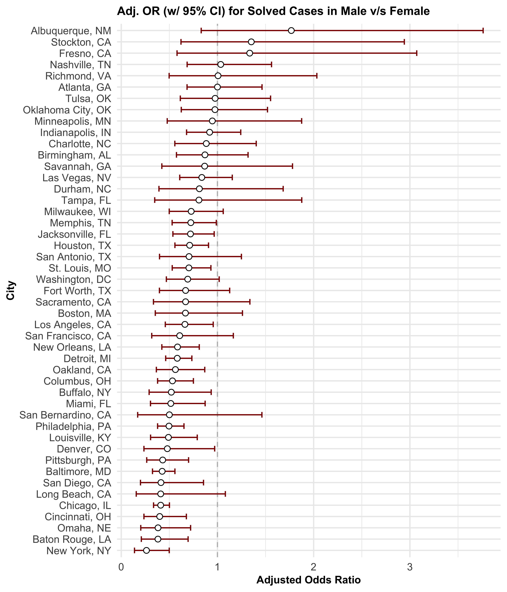

Linear Models
================
Chhiring Lama
2024-11-27

## Problem 1

``` r
weather_df <-  
  rnoaa::meteo_pull_monitors(
    c("USW00094728"),
    var = c("PRCP", "TMIN", "TMAX"), 
    date_min = "2017-01-01",
    date_max = "2017-12-31") %>%
  mutate(
    name = recode(id, USW00094728 = "CentralPark_NY"),
    tmin = tmin / 10,
    tmax = tmax / 10) %>%
  select(name, id, everything())
```

Running simple linear regression with `tmax` as the response and `tmin`
as the predictor in 5000 bootstrap samples:

``` r
bootstraps <- weather_df |> 
  modelr::bootstrap(5000) |> 
  mutate(strap = map(strap, as_tibble), 
         linear_model = map(strap, \(df) lm(tmax ~ tmin, data = df)), 
    results = map(linear_model, broom::tidy), 
    summary = map(linear_model, broom::glance))

bootstrap_r_squared <- bootstraps |> 
  unnest(summary) |> 
  select(.id, `r.squared`) 

bootstrap_log_estimate <- bootstraps |> 
  unnest(results) |> 
  select(.id, estimate) |> 
  group_by(`.id`) |> 
  summarize(log_estimate = prod(estimate) |> log()) 

merged_results <- bootstrap_r_squared |> 
  inner_join(bootstrap_log_estimate, by = ".id")
```

Plot the distribution of the $r^2$ and
$log(\hat{\beta_0} *\hat{\beta_1})$ estimates.

``` r
merged_results |> 
  pivot_longer(
    cols = 2:3, 
    names_to = "type",
    values_to = "estimate"
  ) |> 
  mutate(
    labels = case_when(type == "log_estimate" ~ "log(hat(beta[0])*hat(beta[1]))", 
                      type == "r.squared" ~ "r^2")) |> 
  ggplot(aes(x = estimate, fill = type)) +
  geom_density(alpha = 0.4) +
  facet_wrap(~labels, scales = "free", 
             ncol = 1, labeller = label_parsed) +
  theme(legend.position = "none") +
  labs(x = "Estimate", 
       y = "Density", title = "Distribution of the Estimates")
```


The estimates of $r^2$ and $log(\hat{\beta_0}*\hat{\beta_1})$ (as shown
above) are normally distributed.

``` r
r_squared_ci <- bootstrap_r_squared |> 
  summarise(boot_ci_ll = quantile(`r.squared`, 0.025) |> round(digits = 3), 
            boot_ci_ul = quantile(`r.squared`, 0.975) |> round(digits = 3))

log_estimate_ci <- bootstrap_log_estimate |> 
  summarise(boot_ci_ll = quantile(log_estimate, 0.025) |> round(digits = 3), 
            boot_ci_ul = quantile(log_estimate, 0.975) |> round(digits = 3))
```

95% confidence interval for $r^2$ and $log(\hat{\beta_0}*\hat{\beta_1})$
are (0.894, 0.927) and (1.965, 2.059) respectively. We are 95% sure that
the model explains between 0.894 and 0.927 of variance in the maximum
temperature.

## Problem 2

Import and clean homicide data from the Washington Post:

``` r
homicide_data <- read_csv("data/homicide-data.csv") |> 
  mutate(state = toupper(state), 
         city_state = str_c(city, state, sep = ", "), 
         result = case_when(disposition %in% c("Closed without arrest", 
                                                "Open/No arrest") ~ "unresolved", 
                            disposition == "Closed by arrest" ~ "resolved"), 
         result = as_factor(result), 
         victim_age = as.numeric(victim_age), 
         result = as.numeric(result == "resolved"),
    victim_race = fct_relevel(victim_race, "White")) |> 
  filter(!city_state %in% c("Dallas, TX", "Phoenix, AZ", 
                            "Kansas City, MO","Tulsa, AL"), 
         victim_race %in% c("White", "Black"))
```

Run logistic Regression with `result` (resolved versus unresolved) as
the outcome and victim age, sex and race as predictors for Baltimore,
MD.

``` r
baltimore_df <- homicide_data |> 
  filter(city_state == "Baltimore, MD") |> 
  select(result, victim_age, victim_race, victim_sex)

logistic_mod <- glm(result ~ victim_age + victim_sex + victim_race, 
                    data = baltimore_df, family = binomial())
saveRDS(logistic_mod, "logistic_mod_baltimore_result.rds")

logistic_mod <- logistic_mod |> 
  broom::tidy() |> 
  mutate(adj_OR = exp(estimate), 
         ci_ll = round(exp(estimate - 1.96 * std.error), 3), 
         ci_ul = round(exp(estimate + 1.96 * std.error), 3)) |>
  select(term, adj_OR, ci_ll, ci_ul, p.value) 

res_male <- logistic_mod |> 
  filter(term == "victim_sexMale") 

or_male <- pull(res_male, `adj_OR`) |> 
  round(digits = 3)

logistic_mod |> 
  knitr::kable(digits = 3) 
```

| term             | adj_OR | ci_ll | ci_ul | p.value |
|:-----------------|-------:|------:|------:|--------:|
| (Intercept)      |  3.164 | 1.989 | 5.031 |   0.000 |
| victim_age       |  0.993 | 0.987 | 1.000 |   0.043 |
| victim_sexMale   |  0.426 | 0.325 | 0.558 |   0.000 |
| victim_raceBlack |  0.431 | 0.306 | 0.607 |   0.000 |

Upon running the logistic regression, at 5% significance level and after
keeping all other variables fixed, we have significant evidence that
male victims have lower probability (0.574 less likely) of having
homicides solved compared to female victims. We are 95% confident that
the true adjusted odds ratio is between 0.325 and 0.558.

Run the model for each city in the dataset

``` r
logistic_allcities_df <- homicide_data |> 
  filter(victim_sex %in% c("Female", "Male")) |> 
  nest(data = -city_state) |> 
  mutate(
    model = map(data, \(x) glm(result ~ victim_age + victim_sex + victim_race, 
                    data = x, family = binomial())), 
    results = map(model, broom::tidy)
  ) |> 
  select(city_state, results) |> 
  unnest(results) |> 
  filter(term == "victim_sexMale") |> 
  mutate(adj_OR = exp(estimate), 
         ci_ll = round(exp(estimate - 1.96 * std.error), 3), 
         ci_ul = round(exp(estimate + 1.96 * std.error), 3)) |>
  select(city_state, term, adj_OR, ci_ll, ci_ul, p.value) 
```

Plot ORs and CIs for each city

``` r
logistic_allcities_df |> 
  mutate(city_state = fct_reorder(city_state, adj_OR)) |>
  ggplot(aes(x = city_state, y = adj_OR)) +
  geom_hline(yintercept = 1, linetype = "dashed", color = "grey") +
  geom_errorbar(aes(ymin = ci_ll, ymax = ci_ul),color = "darkred", width = 0.5)+
  geom_point(size = 2, shape = 21, fill = "white") +
  theme(plot.title = element_text(size = 10, face = "bold")) +
  labs(y = "Adjusted Odds Ratio", x = "City",
       title = "Estimate of Unsolved Homicide Cases (w/ 95% CI) in Male Victims versus Female", color = "") +
  coord_flip()
```


There are four cities where estimated adjusted odds ratio is greater
than one (Albuquerque, Stockton, Fresno and Nashville) which means that
male victims in these cities are more likely to have their case resolved
compared to female victims. In all the other 43 cities, male victims
have less odds of a resolved homicide case than female victims. In
Richmond and Atlanta, male and females have almost equal chance of
solved case.
